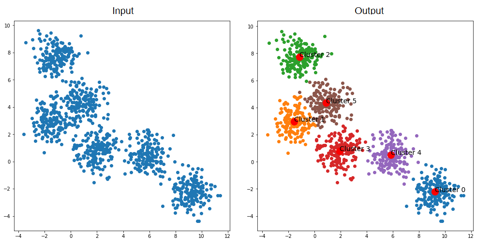

# [PCA_Clustering](https://launchpad-5ycggqe1ym45.curve.space/PCA_Clustering)

# Introduction

For the purpose of the exercice, I've to analyse international's chicken market.
Such analyzes will help us firstly getting a better understanding 
of **global chicken trade market** and on the other hand finding out new **trade agreement** over the world. 

How it works ?

# Pestel Analyze

Before bringing the countries together, we have to decide what are the best features to match with our vision.
**P**olitical, **E**conomical, **S**ocial, **T**echnological, **E**cological and **L**egal are good topic to begin. 

For example, Political criteria bring us more information about government's stability (No conflict).  
As GDP's growth feature give us some usefull information about the **economic health and development** of a country.

Go deeper on Pestel analyze with a full detailed application available [here](https://github.com/marcadeant/PCA_Clustering/blob/main/Notebooks/Data%20Cleaning.ipynb)

# Data Sources

I enjoy open world datawarehouse from [World Bank Group](https://www.worldbank.org/en/home) and [Food and Agriculture Organization](https://www.fao.org/home/en) to build my entire training set.
I highly recommend to checkout their website as I did. 

* Every data exported from WBG and FAO are available in [Data Source](https://github.com/marcadeant/PCA_Clustering/tree/main/Data%20Source) repository
* [Complete training set]() as a results of [step by step data preparation program](https://github.com/marcadeant/PCA_Clustering/blob/main/Notebooks/Data%20Cleaning.ipynb) that I used to feed my clustering model

# PCA for clustering approach

PCA results and interpretation are fully exposed in [Clustering notebook](https://github.com/marcadeant/PCA_Clustering/blob/main/Notebooks/Clustering.ipynb).

I try two differents clustering approach with **hierarchical clustering** firstly following by the famous **Kmeans**.
All of those 2 methods are based on distance calculation between each point and the nearest or further centroid.

**NB** : Hierarchical clustering is set up with longest point-cluster distance while the reverse is operated for Kmeans.

For the features I used to feed the model, take a look into [``acp_training_set``](https://github.com/marcadeant/PCA_Clustering/tree/main/Data%20set)

# Conclusion

As a result of our clustering, I identified 2 interesting clusters :
1. Cluster with underdeveloped countries struggling with social inequalities and food deficit
2. Cluster with developed countries, stable government and low international chicken trade  

